# Kratek uvod v uporabo programa Praat

## O programu

Praat [@boersma_praat_2026] je brezplačen računalniški program, ki sta ga razvila Paul Boersma in David Weenink z Inštituta za fonetiko Univerze v Amsterdamu ter ga še naprej aktivno posodabljata. Koda programa je odprtokodna. Za analizo govora trenutno ni boljšega orodja, ki omogoča urejanje zvočnega signala (zvočnih posnetkov), njegovo označevanje ter številne akustične analize (formanti samoglasnikov, analiza soglasnikov, intonacija itd.). Program je na voljo za širok spekter platform (Windows, MacOS, Linux itd.), za mobilna operacijska sistema Android in iOS pa še ni na voljo.

V tem poglavju za uporabo programa bomo razložili uporabo le nekaterih najosnovnejših funkcij, več informacij je na voljo v drugih priročnikih (npr. @styler_using_2023, @weenink_speech_2025, @van_lieshout_praat_2003, @goldman_praat_2004), ki so brezplačno na voljo na spletu, na spletu najdete tudi video posnetke uporabe programa Praat.

### Različice programa
Ta priročnik je napisan za različico 6.4.60 (10. februar 2026, @boersma_praat_2026). Preden začnete z delom, si prenesite najnovejšo različico programa (gl. poglavje @sec-namestitev-programa), saj so novejše različice stabilnejše. Vse slikovno gradivo je bilo zajeto v operacijskem sistemu Windows 11, na drugih operacijskih sistemih uporabniški vmesnik izgleda nekoliko drugače, vse funkcije pa so na istih mestih.

Različico programa preverimo s klikom v oknu **Praat Objects** na gumb `Help > About Praat…`

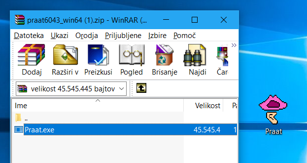{#fig-praat1 width=50%}

### Namestitev programa {#sec-namestitev-programa}

Program snamemo s spletne strani [http://www.fon.hum.uva.nl/praat/](http://www.fon.hum.uva.nl/praat/) in izberemo različico za operacijski sistem, ki je naložen na našem računalniku. Izbiramo lahko med 64-bitno in 32-bitno različico, izbor je odvisen od različice operacijskega sistema. To preverimo tako, da z desnim gumbom kliknemo na mapo `Ta računalnik > Lastnosti`, različico preverimo v vrstici `Vrsta sistema` (64-bitni operacijski sistem ali 32-bitni operacijski sistem). Najverjetneje imamo 64-bitni operacijski sistem. Na računalnik se bo prenesla datoteka tipa ZIP, ki jo odpremo, datoteko `Praat.exe` pa povlečemo na poljubno mesto na računalniku – najbolje, da kar na namizje -- gl. sliko -@fig-praat1. Praat je tako ustrezno nameščen na našem računalniku.

# Delovno okolje programa

Po zagonu programa Praat se samodejno odpreta dve okni: **Praat Objects** in **Praat Picture**. Okno **Praat Pictures** lahko zapremo, saj se uporablja le za različne izrise. Na tem mestu bomo na kratko predstavili funkcionalnosti posameznih oken, nekatera bomo srečali kasneje.

Okno **Praat Objects** je glavno okno programa, s pomočjo katerega lahko odpremo različne datoteke in jih shranjujemo, ustvarjamo nove zvočne datoteke, npr. posnamemo zvok, in s pomočjo katerega odpremo različne urejevalnike in izvajamo poizvedbe nad posnetki. V polje Objects lahko nalagamo različne objekte (datoteke). Meniji na desni od objektov se spreminjajo glede na to, kateri objekt izberemo (trenutno nimamo naloženih in izbranih objektov, zato meniji niso prikazani, gl. sliko -@fig-praat2, gumbi so prikazani na sliki -@fig-praat4).

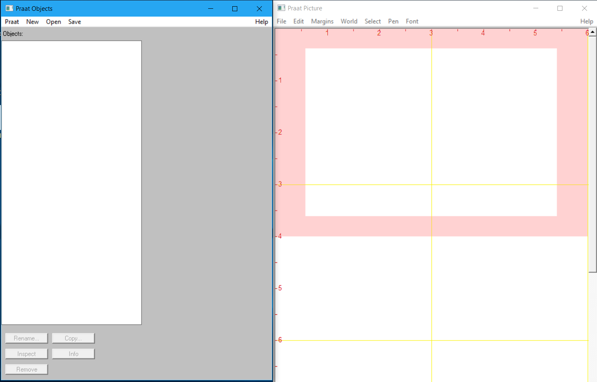{#fig-praat2 width=60%}

Ko izberemo poljuben objekt, se spodaj prikažejo gumbi za preimenovanje objekta (`Rename`), podvajanje/kopiranje objekta (`Copy…`), odstranjevanje objekta (`Remove`), informacije o objektu (`Info`) ter za pregledovanje internih podatkov objekta (`Inspect`).

Okno **Praat Picture** se uporablja za izdelavo kakovostnih izrisov za objavo v publikacijah. Okno se odpre samodejno ob zagonu programa. Več o delu z njim v poglavju @sec-izdelovanje-izrisov.

Okno **View & Edit** je pregledovalnik in urejevalnik posnetkov. Ko bomo pregledovali zvočno datoteko, bomo v tem oknu zgoraj videli oscilogram (angl. sound's waveform), spodaj pa spektrogram. Z miškinim kazalcem bomo izbirali dele posnetka ter izvajali meritve. Menijski gumbi zgoraj omogočajo prikaz različnih informacij (formanti, osnovni ton, jakost) ter izvajanje natančnejših poizvedb.

Ko bomo izvajali poizvedbe, se bodo podatki prikazali v pojavnih oknih. Podatke lahko skopiramo na drugo mesto in jih shranimo.

Ukazi v navodilih bodo podani na naslednji način: `Objects > Query > Query Time Domain > Get Total Duration` 

Kar pomeni, da v oknu Objects kliknemo na gumb `Query`, nato na možnost `Query Time Doman` in nato na `Get Total Duration`.

## Snemanje zvoka

Zvočni posnetek lahko posnamemo kar v Praatu. Računalnik mora imeti vgrajen mikrofon (prenosnik) ali pa uporabimo zunanji mikrofon, ki ga priključimo v računalnik. Snemali bomo enokanalni signal (način mono), saj govor enega govorca vsebuje le enokanalni signal. Stereo oz. dvokanalni zvok snemamo takrat, ko zvok prihaja od dveh oseb oz. iz dveh smeri, saj pri stereo zvoku lahko ločimo levo in desno sled. Zvok posnamemo na naslednji način:

`Objects > New > Record mono Sound …`

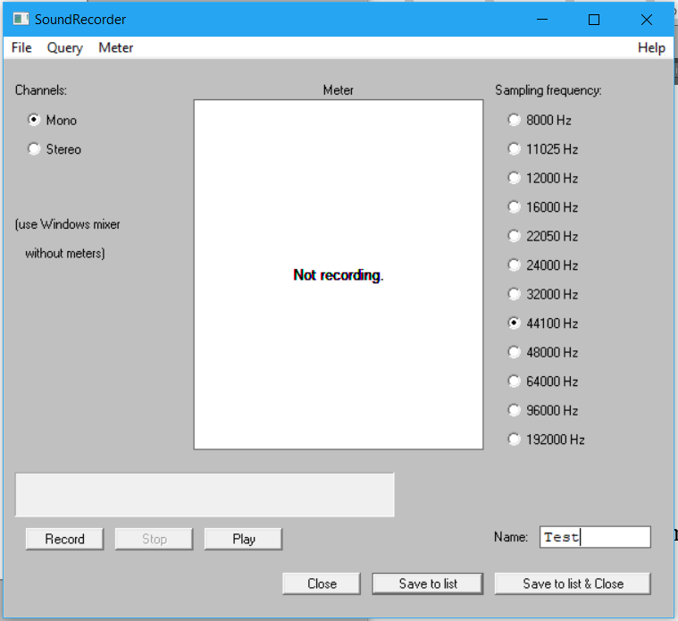{#fig-praat3 width=50%}

Odpre se okno, v katerem izberemo način snemanja **mono** (gl. sliko -@fig-praat3), frekvenca naj ostane 44.100 Hz, v polju `Name` pa lahko izberemo poljubno ime našega posnetka. Snemanje začnemo z gumbom `Record`, ustavimo s `Stop`, poslušamo s `Play`. Ko smo s posnetkom zadovoljni, ga shranimo na seznam objektov z gumbom `Save to list` oz. `Save to list & Close`. Pri snemanju bodite pozorni, da naša glasnost ne presega zelenega območja. Če zelenega stolpca med snemanjem ne vidimo, to pomeni, da mikrofon ni vključen oz. omogočen. To moramo urediti v nastavitvah računalnika.

Posnetek se pojavi na seznamu Objects. Pred imenom datoteke je zapisan tip datoteke, torej Sound (zvok), gl. sliko -@fig-praat4.

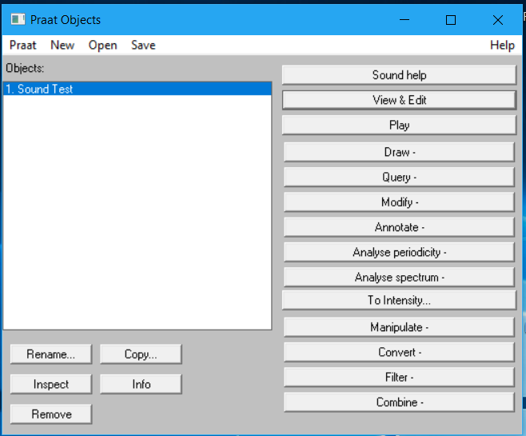{#fig-praat4 width=50%}

Praat ima v naprej omejeno velikost datoteke, ki jo lahko posnamete. Večje datoteke in s tem daljše posnetke lahko posnamete tako, da spremenite največjo možno velikost datoteke: `Objects > Praat > Preferences > Sound Recording Preferences…`, Buffer size (MB) nastavimo na višjo vrednost, privzeta je 60 MB. Najbolje pa je, da daljše posnetke posnamemo z drugim programom in jih naknadno uvozimo v Praat. Priporočamo brezplačen program **Audacity**, dostopen je na povezavi: [https://www.audacityteam.org/](https://www.audacityteam.org/).

## Odpiranje zvočne datoteke

Poljubno zvočno datoteko odpremo oz. uvozimo v Praat z ukazom: `Objects > Open > Read from file…`

Odpre se pogovorno okno, v katerem poiščemo poljubno zvočno datoteko in jo odpremo. Praat odpira najrazličnejše zvočne datoteke,[^1praat], med drugim tudi WAV, FLAC in MP3. Na ta način lahko odpremo tudi shranjene projekte, ki smo jih že naredili v programu Praat, ter nadaljujemo z delom.

[^1praat]: Seznam vseh tipov zvočnih datotek, ki jih Praat lahko odpre, je dostopen na povezavi: [https://www.fon.hum.uva.nl/praat/manual/Sound_files_3__Files_that_Praat_can_read.html](https://www.fon.hum.uva.nl/praat/manual/Sound_files_3__Files_that_Praat_can_read.html).

### Delo z daljšimi posnetki

Praat se pri delu z daljšimi zvočnimi datotekami izkaže kot nestabilen, zato se skušamo izogniti odpiranju daljših posnetkov od 20 min. Če moramo odpreti daljši posnetek, to storimo z ukazom: `Objects > Open > Open long sound file…`

Če posnetek odpremo kot `long sound file`, v Praatu ne bodo na voljo vse funkcije, zato priporočamo, da se pred uvozom posnetka v Praat ta v programu kot je **Audacity** razreže na krajše posnetke, ki se jih nato uvozi v Praat po običajni poti.

## Shranjevanje datotek
Praat ničesar ne shrani samodejno. Med urejanjem se naše delo shrani v oknu Objects, a preden zapremo Praat, moramo želene objekte sami shraniti, saj se bo sicer naše delo izgubilo. 

Če želimo shraniti celoten projekt oz. več datotek (posnetke, TexGrid ipd.), moramo najprej označiti vse datoteke, ki jih želimo shraniti. Ob izbiranju datotek držimo tipko `Ctrl` na tipkovnici, izbrane datoteke morajo biti obarvane modro. Projekt shranimo z ukazom: `Objects > Save > Save as binary file…`

Posamezne zvočne datoteke shranimo z ukazom: `Objects > Save > Save as WAV file…` (ali pa kot kakšen drug tip zvočne datoteke).

Druge vrste objektov pa lahko shranimo kot besedilno datoteko, torej: `Objects > Save > Save as text file…`

## Delo z zvočnim objektom (Sound object)

Ko imamo na seznamu objektov neko zvočno datoteko, kliknemo nanjo, da se pokažejo menijski gumbi na desni (gl. sliko -@fig-praat4). Razložimo na kratko, za kaj se uporabljajo nekateri gumbi, prikazani na desni, ki jih bomo uporabljali.

- `Sound help`: Odpre okno za pomoč z dodatnimi informacijam o delu z zvočnimi datotekami v programu.
- `View & Edit`: Odpre se urejevalno okno za delo z zvokom.
- `Play`: Predvaja zvočno datoteko. Predvajanje ustavimo s tipko `ESC`.
- `Draw --`: Odpre meni za izris v oknu **Praat Picture**, ki smo ga pred tem zaprli.
- `Query --`: Odpre meni za različne poizvedbe, npr. celotno dolžino posnetka dobimo z ukazom `Query > Get time domain > Get total duration`. 
- `Modify --`: Omogoča manipulacijo z zvočno datoteko, npr. ukaz `Reverse` zvočni posnetek prezrcali -- poslušamo ga lahko »nazaj«. Originalen posnetek dobimo, če ukaz izvedemo še enkrat. 
- `Annotate --`: Omogoča, da ustvarimo `TextGrid`, na katerega označujemo (anotiramo) posnetek (npr. besede, foneme, premore ipd.). Ukaz `Annotate > To TextGrid…` ustvari besedilni objekt za označevanje posnetka. Ukaz `Annotate > To TextGrid (silences)` samodejno razdeli posnetek na odseke med premori -- kako dolgi so premori, določimo v vmesniku, ki se odpre. 
- `Convert --`: Omogoča različne pretvorbe posnetka, npr. iz načina stereo v mono. 
- `Combine --`: Omogoča združevanje dveh objektov, npr. združimo lahko več objektov TextGrid, tj. več ravni označevanja. 

Podrobnejše informacije so dostopne v zavihku `Help`, v navodilih programa ter na njegovi spletni strani.

### Okno View & Edit

Posnetek, ki smo ga posneli oz. uvozili v Praat, lahko urejamo v oknu **View & Edit**. Izberemo posnetek ter izvedemo ukaz:	`Objects > View & Edit`

Odpre se okno **View & Edit**. Zgoraj vidimo **oscilogram**,[^2praat] spodaj pa, če je posnetek kratek, **spektrogram**.[^3praat] Pri prikazu (slika -@fig-praat5) imamo omogočen prikaz spektrograma, osnovne frekvenca F~0~ (pitch; modra črta spodaj), intenzitete/jakosti (zelena črta spodaj), formantov (rdeče pike spodaj) ter ciklov (glottal pulses; modre navpične črte zgoraj). V zgornjih menijih lahko posamezne prikaze skrijemo, če jih ne potrebujemo.

[^2praat]: Valovna oblika (oscilogram, časovni potek, waveform) [@jurgec_natancnost_2004, str. 35]. Grafični prikaz nihanja zvoka (govoril ali zračnega toka). Iz števila nihajev in njihove amplitude se da izračunati višino tona, fizikalna jakost ter ločiti se da posamezne glasove [@toporisic_enciklopedija_1992].

[^3praat]: Grafični prikaz zvoka na podlagi analiziranega zračnega valovanja; razporeditev energije po spektru [@toporisic_enciklopedija_1992].

To lahko storimo na dva načina. Lahko s klikom na meni za vsako funkcijo posebej:

- `View & Edit > Spectrogram > Show spectrogram`
- `View & Edit > Pitch > Show pitch`
- `View & Edit > Intensity > Show intensity`
- `View & Edit > Formants > Show formants`
- `View & Edit > Pulses > Show Pulses`

Tako lahko skrijemo ali pa prikažemo spektrogram, intonacijo, intenziteto, formante ali cikle. Najbolj uporaben pa je ukaz: `View & Edit > Analyses > Show analysis…`

S katerim prikličemo pogovorno okno, v katerem obkljukamo vse stvari, ki jih želimo imeti prikazane v oknu **View & Edit**. 

Če smo odprli dvokanalni (stereo) posnetek, bomo videli dva oscilograma.

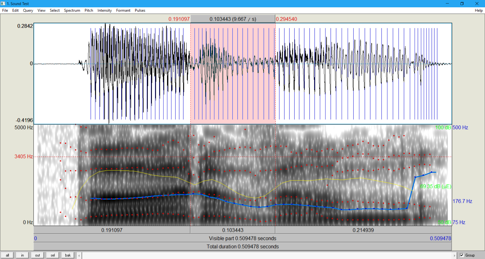{#fig-praat5 width=70%}

Spodaj levo so gumbi, ki omogočajo različen prikaz posnetka. Z gumbom `all` bomo videli celoten posnetek v oknu, `in` približa posnetek, `out` ga oddalji, `sel` nam približa označen del posnetka (označimo ga z miško – obarva se rožnato).

Posnetek predvajamo s klikom na pasice `Total duration` za predvajanje celotnega posnetka, `Visible part` za predvajanje prikazanega dela, s klikom na pasico nad ali pod označenim delom posnetka pa lahko poslušamo le izbrani del. Na tej pasici je zapisana izbrana dolžina posnetka v ms (izbrani del posnetka na sliki -@fig-praat5 je dolg 197 ms).

### Izrezovanje dela posnetka

Če želimo analizirati le del posnetka (npr. 1 beseda, 1 samoglasnik), je najbolje, da ta del izoliramo ter ga shranimo kot samostojno zvočno datoteko. Najprej z miško označimo del posnetka, ki ga želimo izolirati, nato pa izvedemo ukaz: `View & Edit > Sound > Extract Selected Sound (time from 0)`

Funkcija `Extract Selected Sound (time from 0)` bo začetni čas izrezanega posnetka nastavila na 0, lahko pa originalni čas obdržimo, in sicer z uporabo funkcije `Extract Selected Sound (preserve times)`. Torej, če se začetek dela, ki smo ga označili začne na 0,26 sekunde, se bo izrezani posnetek začel z 0,26 sekunde in ne z 0 sekunde.

Del posnetka lahko izrežemo tudi s funkcijo v oknu Objects, a pri tem moramo ročno vpisati interval, ki ga želimo izrezati: `Objects > Convert > Extract part…`

Del posnetka lahko neposredno shranimo kot datoteko na disk računalnika z ukazom: `View & Edit > File > Save selected sound as ...`

Pri tem izberemo želeni format datoteke in v pogovornem oknu izberemo lokacijo za shranjevanje. 

### Nastavitve spektrograma {#sec-nastavitve-spektrograma}

Nastavitev spektrograma običajno ne spreminjamo, saj so privzete nastavitve za večino analiz ustrezne. Privzeto bomo videli na spektrogramu frekvence od 0 do 5000 Hz. Če želimo, nastavitve spremenimo z ukazom: `View & Edit > Spectrogram > Spectrogram settings`

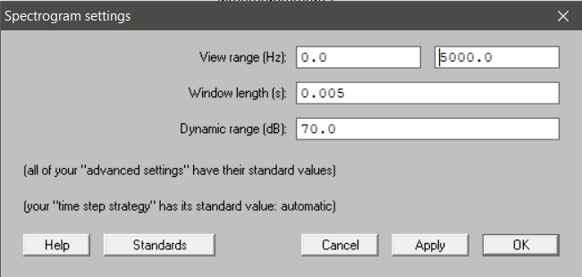{#fig-praat6 width=50%}

Odpre se okno (slika -@fig-praat6), oglejmo si nastavitve:

`View range` ali frekvenčni razpon (v Hz) za običajno analizo sega med 0 in 5000 oz. 6000 Hz. Če raziskujemo pripornike, moramo zgornjo mejo frekvenčnega razpona povečati, celo do 15000 Hz. Če imamo odprto glasbeno datoteko, zadostuje frekvenčni razpon do 100 do 2000 Hz. Spektrum si vedno lahko poljubno nastavimo.

`Dynamic range` ali glasnost (v dB) prilagodimo glede na to, ali je spektrogram presvetel oz. pretemen. Gre namreč za razliko med glasnimi in tihimi frekvencami. Za običajno analizo je ustrezna vrednost že 50 dB, mi imamo nastavljeno na 70 dB.

`Window length` je dolžina posnetka, ki jo Praat vzame za analizo posameznega parametra (v sekundah). S tem določimo natančnost naše analize. Za bolj natančne analize čas zmanjšamo.

#### Ozkopasovni (angl. narrowband) in širokopasovni (angl. broadband) spektrogram

Praat privzeto prikaže širokopasovni spektrogram, ki je primeren za opazovanje večjih delov posnetka, za ogled formantov samoglasnikov ipd. Za opazovanje osnovnih harmoničnih frekvenc in osnovnega tona (F~0~) pa uporabimo ozkopasovni spektrogram (gl. sliko -@fig-praat6).

1. `View & Edit > Spectrogram > Spectrogram settings`;
1. `Window Length` nastavimo na 0.025 (ali več);
1. Kliknemo OK. 

Zdaj so harmonične vrednosti jasno vidne, na ta način tudi najlažje vidimo osnovno frekvenco.

Na širokopasovni spektrum se vrnemo z naslednjimi ukazi:

1. `View & Edit > Spectrum > Spectrum Settings`;
1. `Window Length` nastavimo na 0.005;
1.	Kliknemo `OK`. 

Primerjajte razliko med ozkopasovnim in širokopasovnim spektrogramom na sliki -@fig-praat6-spektrum.

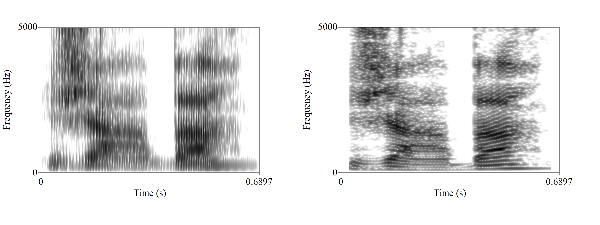{#fig-praat6-spektrum width=100%}

### Merjenje trajanja

Trajanje poljubnega dela posnetka lahko izmerimo na več načinov. Najlažje v oknu **View & Edit**, kjer z miško označimo del posnetka, podatek o trajanju pa preberemo nad označenim ali pod označenim delom. Podatek o trajanju označenega dela posnetka lahko dobimo z ukazom: `View & Edit > Time > Get length of selection`

Podatek se pokaže v novem oknu, od koder ga lahko skopiramo na drugo mesto.

### Merjenje formantov samoglasnikov

Za samoglasnike so značilni štirje formant (F~1~, F~2~, F~3~ in F~4~), v Praatu jih lahko vidimo tudi več. Prvi formant ima najnižjo frekvenco, zato se na spektrogramu nahaja spodaj, sledi mu drugi formant itd. Najbolj razlikovalna sta F~1~ in F~2~.

Formante lahko merimo v določeni točki ali pa na intervali, tedaj izmerimo povprečje. Najbolje je, da formante merimo na najstabilnejšem delu samoglasnika –- tam, kjer je zvočno nihanje najenakomernejše (oscilogram) ter kjer so frekvence najbolj stabilne (spektrogram). Pred merjenjem moramo formante prikazati, sicer Praat ne bo izmeril njihove vrednosti.

Formant samoglasnika v točki izmerimo na naslednji način:

1. Na posnetku izberemo točko v stabilnem delu samoglasnika.
2. Na tipkovnici pritisnemo tipko `F1` (za F~1~), `F2` (za F~2~), `F3` (za F~3~) in `F4` (za F~4~). Ali pa z ukazom `View & Edit > Formant > Get first formant / Get second formant…`
3. V pojavnem oknu se pokaže vrednost v Hz, ki so skopiramo na željeno mesto (npr. v wordov dokument).

Formant samoglasnika na intervalu, tj. njegovo povprečje, izmerimo na enak način kot v točki, le na posnetku ne označimo točke, temveč interval.

Podatke o posameznih formantih zapisujemo običajno v tabelo. Pri svojih meritvah opredelimo, kako smo formante merili, tj. točkovno ali s pomočjo intervalov.

Poleg vrednosti formantov lahko izmerimo tudi njihov frekvenčni obseg. To storimo z ukazi:

- `View & Edit > Formants > Get first bandwidth`
- `View & Edit > Formants > Get second bandwidth`
- `View & Edit > Formants > Get third bandwidth`
- `View & Edit > Formants > Get fourth bandwidth`

## Označevanje posnetka (TextGrid)

Posnetke označujemo s pomočjo funkcije `TextGrid`. Za vsak posnetek ustvarimo svoj TextGrid. V oknu **Objects** izberemo posnetek ter izvedemo ukaz: `Objects > Annotate > To TextGrid…`

Odpre se meni za določitev ravnin, gl. sliko -@fig-praat7. Koliko ravnin izberemo, je odvisno od tega, kaj vse želimo označevati. Poimenujemo vse nivoje, ki jih želimo (nivo je lahko tudi le eden). Tukaj bomo naredili 2, enemu bomo rekli `fonem`, drugemu pa `beseda`, gl. sliko -@fig-praat8. Poimenovanja ravnin so poljubna, je pa dobro, da nam ime pove, kaj označujemo. Posamezno ravnino lahko poimenujemo po govorcu, ki ga bomo označevali (npr. *Mary John*). To vnesemo v polje `All tier names`. Med poimenovanji ne pišemo ločil! Drugo polje `Which of these are point tiers?` bomo pustili prazno, saj ne bomo označevali točk, ampak intervale, saj so nedefinirane ravnine vedno namenjene označevanju intervalov. Kliknemo `OK` ali `Apply`.

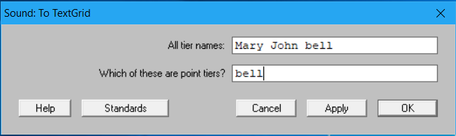{#fig-praat7 width=50%}

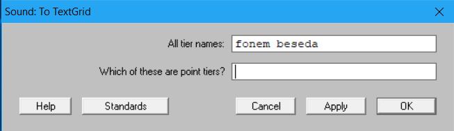{#fig-praat8 width=50%}

Na seznamu objektov se pojavi objekt `TextGrid`. Zdaj izberemo **oba** objekta, posnetek in TextGrid. Držimo levi `Ctrl` in kliknemo najprej posnetek Sound in nato še TextGrid, izpustimo `Ctrl`. Oba objekta morata biti obarvana modro. V desnem meniju kliknemo na gumb `View & Edit`. Odpre se okno za urejanje posnetka, dodani pa sta mu dve vrstici, v katerih lahko določamo intervale ter v intervale pišemo. Na desni strani vsake ravnine je tudi njeno ime. Tista raven, ki je obarvana rumeno, je izbrana za pisanje. Interval najlažje naredimo tako, da izberemo del posnetka, ki ga želimo označiti, ter pritisnemo tipko `Enter`.

Na enak način lahko označujemo točke. Izberemo točko na posnetku ter pritisnemo `Enter`. 

Na posamezno mejo (boundary) lahko kliknemo ter jo z vlečenjem premaknemo, s kombinacijo tipk `Alt + Backspace` pa tudi izbrišemo. Vse to je mogoče tudi preko menija Boundary zgoraj: `View & Edit > Boundary > Remove`

Besedilo dodamo lahko na interval, ki smo ga ustvarili oz. zamejili. Izberemo interval, ta se obarva rumeno, ter nanj vpišemo besedilo. V primeru (gl. sliko -@fig-praat9) smo besedo razdelili na foneme (perceptivna oz. slušna analiza) in označili njihove meje, na interval vsakega fonema smo zapisali fonetični znak za ta fonem. Na 2. nivoju pa smo označili besedo *žaba* ter jo zamejili. Pri daljših posnetkih bi zamejili seveda več besed. Razdelitev posnetka na besede (lahko tudi stavke, povedi/izjave, npr. slika -@fig-praat10) se zdi smiselna tedaj, ko imamo opravka z daljšim besedilom/posnetkom. Pri krajših, kot je ta, pa je to nepotrebno.

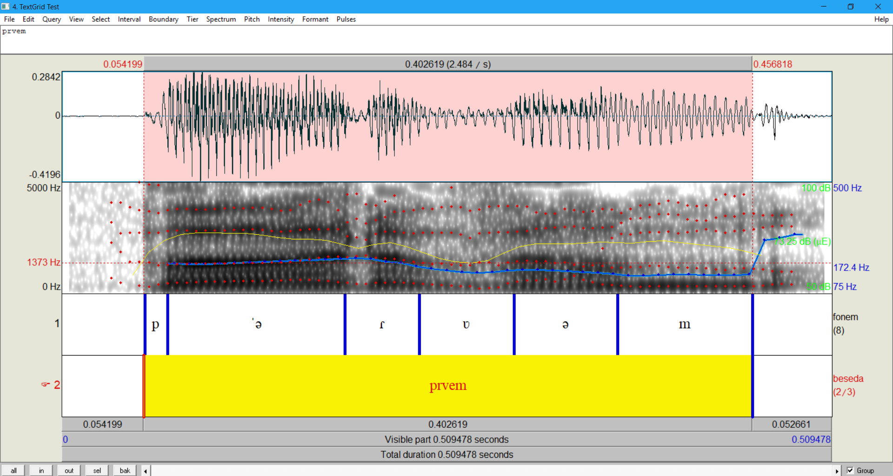{#fig-praat9 width=50%}

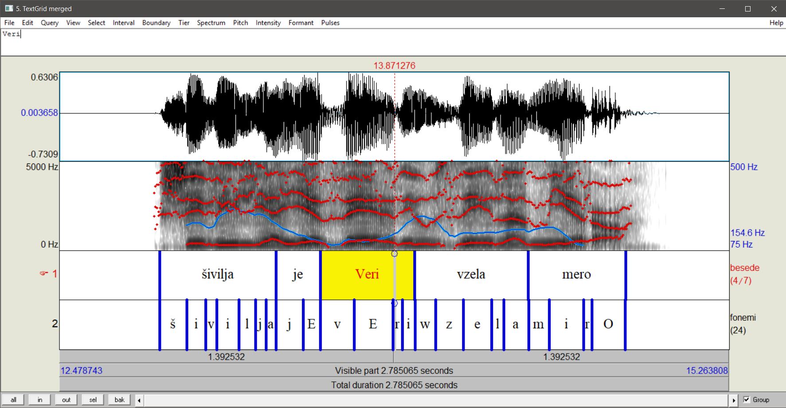{#fig-praat10 width=90%}

### Izvoz označenih delov

Označene intervale lahko tudi izvozimo iz posnetka, tako lažje analiziramo posamezno besedo/glas. To storimo tako, da v oknu Objects z držanjem leve tipke `Ctrl` izberemo zvočno datoteko ter TextGrid (oboje mora biti obarvano modro). Nato izvedemo enega izmed naslednjih ukazov:

- `Objects > Extract- > Extract all intervals…` (za izvoz vseh intervalov)
- `Objects > Extract- > Extract non-empty intervals…` (za izvoz vseh intervalov, v katere smo kaj zapisali)
- `Objects > Extract- > Extract intervals where…` (s to funkcijo lahko postavljamo pogoj, katere intervale želimo izvoziti).

Najuporabnejša je funkcija `Extract non-empty intervals…`, ki jo bomo uporabili tudi tukaj, gl. sliko -@fig-praat11. V pogovornem oknu izberemo ravnino (tier), na podlagi katere želimo izvažati intervale; tukaj je 1. raven (tier 1) *fonem*, 2. raven (tier 2) pa *beseda*. Če želimo izvoziti vse glasove, izberemo tier 1. Nato kliknemo `OK`.

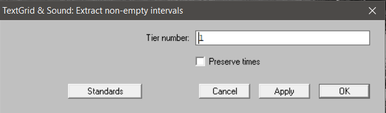{#fig-praat11 width=70%}

Intervali se pokažejo v oknu Objects, gl. sliko -@fig-praat12.

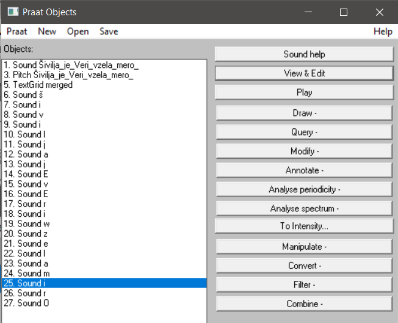{#fig-praat12 width=70%}

Na enak način lahko izvozimo tudi celotno besedo, le v pogovornem oknu moramo izbrati 2. raven (tier 2).

### Shranjevanje posameznih intervalov

Vsak posamezen interval oz. del zvočnega posnetka lahko tudi shranimo kot zvočno datoteko. Izberemo objekt ter izvedemo ukaz: `Objects > Save > Save as WAV file…`

V pogovornem oknu izberemo oz. uredimo ime posnetka ter določimo mesto na računalniku, kamor bo zvočna datoteka shranjena. Izberemo lahko tudi drugi format shranjevanja, a priporočamo WAV format, saj je standarden.

## Izdelovanje izrisov {#sec-izdelovanje-izrisov}

Za prikaz različnih pojavov lahko preprosto zajamemo sliko (screenshot) ter jo prilepimo v dokument.

Za kvalitetnejše prikaze pa nam Praat ponuja nekaj funkcij, ki jih izvedemo v oknu **Picture**, ki se pojavi ob zagonu programa. Postopek je sledeč: izberemo objekt, določimo površino izrisa, nastavimo parametre, dodamo besedilo ipd., izvozimo izris.

### Izris spektrograma

Izberemo posnetek ter izvedemo ukaz: `Objects > Analyse spectrum– > To spectrogram…`

V pogovornem oknu lahko prilagodimo nastavitve, gl. podpoglavje @sec-nastavitve-spektrograma. Tako dobimo na seznamu nov objekt.

V oknu **Picture** z miško označimo površino, na katero želimo postaviti izris, do velikosti površine je odvisna velikost izrisa, saj se te naknadno ne da prilagajati. Izbrana površina se obarva roza.

Privzeta barva izrisa je črna, to lahko spremenimo pred samim izrisom z ukazom: `Picture > Pen > (poljubna barva)`

Nato v oknu Objects kliknemo na ustvarjeni spektrogram te izvedemo ukaz: `Objects > Draw > Paint…`

V oknu **Picture** se pojavi izris. Lahko dodamo še besedilo ipd. z ukazom: `Picture > Margins …`

Izris shranimo z ukazom: `Picture > File > Save as 300-dpi PNG file…`

Lahko pa izris neposredno skopiramo v nek dokument z ukazom: `Picture > Edit > Copy to clipboard`

Površino za risanje pobrišemo z ukazom: `Picture >  Edit > Erase all`

### Izris oscilograma in besedila (TextGrid)

Za izris oscilograma posnetka in besedila, ki smo ga označili, izberemo posnetek in TextGrid ter izvedemo ukaz:	`Objects > Draw…`

V pogovornem oknu lahko določimo časovni interval, če ne želimo, da nam izriše celoten posnetek, gl. sliko -@fig-praat13.

{#fig-praat13 width=70%}

### Izris intonacije

Intonacijski potek (F~0~) izvozimo iz posnetka tako, da najprej izberemo posnetek ter izvedemo ukaz: `Objects > Analyse periodicity > To pitch…`

V pogovornem oknu pustimo privzete nastavitve. Ustvari se objekt Pitch. Lahko izrišemo samo ta objekt ali pa še označene glasove/besede. Za to izberemo še pripadajoči TextGrid ter izvedemo ukaz: `Objects > Draw--`

Izris je odvisen od tega, kateri način risanja izberemo, tukaj so trije primeri: slika -@fig-praat14, slika -@fig-praat15 in slika -@fig-praat16.

{#fig-praat14 width=70%}

{#fig-praat15 width=70%}

{#fig-praat16 width=70%}

### Sestavljeni izris
V oknu **Picture** lahko s pomočjo označevanja posameznih površin sestavimo izris, npr. dodamo spektrogram, oscilogram, TextGrid in še intonacijo. Za to je potrebno nekaj več spretnosti in potrpežljivosti.

Postopek je enak prej opisanemu, le pred izvažanjem izrisa označimo prazen del površine v oknu **Picture** ter tja izrišemo nov element. Ko z risanjem končamo, lahko izris skopiramo.

Pri izrisu (slika -@fig-praat17) smo na levo stran postavili oscilogram in TextGrid, na lepo smo pa najprej izrisali spektrogram ter nanj z rdečo izrisali še TextGrid.

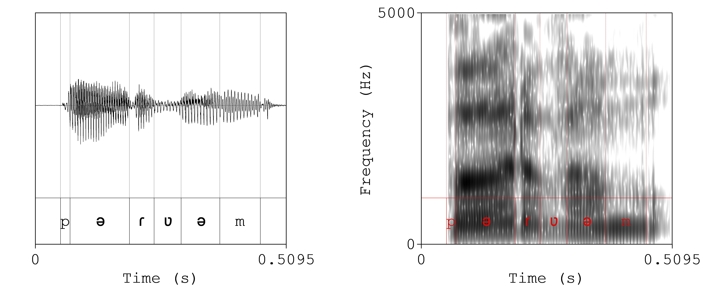{#fig-praat17 width=70%}