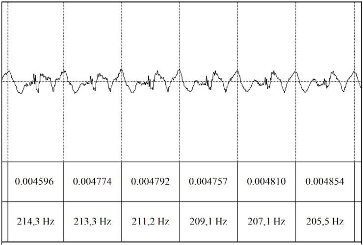

# Osnovna frekvenca in register

**Osnovni ton**[^1o] (F~0~) je rahel, oster zvok, ki pri govoru ne nastopa samostojno, temveč se pri prehodu iz
žrela v ustno votlino oplemeniti z višjimi harmoničnimi frekvencami, tako dobi človeško barvo. Postane
glas. Glas je kompleksen zvok, osnovni ton pa je njegova opredeljujoča in najgloblja sestavina [povzeto po @palkova_fonetika_1997, str. 57]. Nastane z vibriranjem glasilk, ki lahko ustvarijo različne razpone.[^2o] 

[^1o]: @varosanec-skaric_forenzicna_2019 [str. 139] in @astruc_prosody_2015 [str. 130] razložita terminološko razliko med *tonom* (angl. pitch) in
*osnovno frekvenco* (angl. fundamental frequency). Ton je kategorija, ki jo slušno zaznavamo in opredelimo kot (zelo)
globok, srednje višine, (zelo) visok. Ton merimo kot osnovno frekvenco (označimo kot F~0~ ali f~0~). Termina se v literaturi
uporabljata zamenljivo.
[^2o]: @toporisic_enciklopedija_1992 [str. 169] **osnovni ton** opredeli kot "višin[o] tona, odvisn[o] od števila glasilčnih tresljajev na določeno časovno enoto, npr. stotinko sekunde. Po osnovnem tonu se ločijo t. i. glasovi, npr. moški in ženski razne vrste, tudi falzetni."

Višina tona je najbolj odvisna od napetosti glasilk, pri čemer se spreminja njihova dolžina. Kadar so glasilke v nevtralnem položaju, so glasilke odraslega moškega dolge med 15 in 20 mm, odrasle ženske pa med 9 in 13 mm.[^3o] Dolžina zaprtih glasilk pri fonaciji je manjša, za najnižje tone znaša 45 \% dolžine v nevtralnem položaju, za najvišje tone pa 90 \% te dolžine. Višja je frekvenca osnovnega tona, daljše so glasilke. Ko se glasilke podaljšajo, se zmanjša njihova masa (ta se razporedi po celi dolžini), kar prispeva k povišanju osnovnega tona [@horga_artikulacijska_2016, str. 198-199; @basic_akusticka_2018]. Srednja vrednost osnovne frekvence pri moških znaša ca. 120 Hz, pri ženskah pa 230 Hz, to pomeni, da pri ženskah glasilke zavibrirajo 230-krat na sekundo, pri moških pa 120-krat na sekundo. Pri dojenčkih znaša dolžina glasilk ca. 5 mm, zato je tudi njihova osnovna frekvenca višja, ta znaša ca. 400 Hz [@pompino-marschall_einfuhrung_2009, str. 35].	

[^3o]: @pompino-marschall_einfuhrung_2009 [str. 35] navaja, da so pri ženskah glasilke dolge med 13 in 17 mm, pri moških pa med 17 in 24 mm. 

**Osnovno frekvenco** akustično izračunamo na naslednji način 
[@varosanec-skaric_timbar_2005, str. 53]:  

$f_0 = \frac{1}{T}$  

T — čas trajanja ene periode (cikla). Čas enega cikla določimo tako, 
da izmerimo njegovo trajanje. En cikel je ena ponovitev nihajev pri 
samoglasniku (gl. sliko \@ref(fig:slika1-register)).

{#fig-Register1}

Če ena perioda traja 0,008 s, potem je osnovna frekvenca 125 Hz.

Razlika v višini (oktavi) med glasovi se računa s formulo: $10 \log_2 \left(\frac{\text{frekvenca 1}}{\text{frekvenca 2}}\right)$. V števec ulomka zapišemo višjo vrednost, v imenovalec pa nižjo. Če npr. izračunamo razliko v poltonih med tonom C2 (65,408 Hz) in E2 (82,409 Hz), dobimo rezultat 3,333 poltona, rezultat primerjajmo s tabelo na sliki -@fig-register2.

![Lestvica v Hz in poltonih od C2 do C5 [@varosanec-skaric_forenzicna_2019 str. 138]](../slike/Slika2-register.png){#fig-register2}

Pri šepetu vrednost F~0~ znaša okrog 40 Hz, kar znaša 16 poltonov, običajen moški glas ima vrednosti med 116 in 130 Hz oz. med 34 in 36 poltoni. Visoki moški glasovi lahko dosežejo tudi več kot 40 poltonov (nad 164 Hz). Ženski običajni glas ima razpon med 175 in 240 Hz (med 41 in 47 poltoni), visoki ženski glasovi pa lahko dosežejo tudi 400 Hz. Na vrednost F~0~ vpliva tudi glasnost. Pri glasnejšem govoru je vrednost F~0~ višja [@varosanec-skaric_forenzicna_2019, str. 138].

Glede na fiziologijo glasilk višino osnovnega tona izračunamo po naslednji formuli
[@horga_artikulacijska_2016, str. 198–199]:

$f = \frac{1}{2} L \left(\frac{T}{\rho}\right)$  

f — frekvenca vibriranja glasilk, L — dolžina glasilk,  T — napetost glasilk,  $\rho$ — gostota tkiva glasilk.

![Shematični prikaz zgradbe dveh intonacijskih enot [@petursson_elementarbuch_2002, str. 152].](../slike/Slika3-register.png){ width=80% }

## Merjenje osnovnega tona

Osnovni ton merimo v hertzih (Hz). Pri tem se moramo zavedati več ovir: a) interferenca tona nekaterih segmentov (npr. samoglasnika [i] in [e] imata inherentno višji osnovni ton); b) vpliv soglasnikov, zlasti nezvenečih, ki prekinejo vibriranje glasilk;  c) vpliv konca besede oz. stavka;  č) vpliv izvora glasu (npr. hripav glas)  [@astruc_prosody_2015, str. 130]. Zaradi razlik v percepciji frekvenc — človeško uho je bolj občutljivo na razlike pri nizkih frekvencah kot pri visokih — je svetovano, da uporabimo druge skale za primerjave med govorci, npr. logaritemske skale (Mel, bark) ali poltone, gl. sliko -@fig-register2.

Za opazovanje osnovne frekvence (F~0~, *pitch*) je najbolje, da uporabimo ozkopasovni spektrogramski prikaz. V nastavitvah spektrograma *Spectrogram > Spectrogram Settings* nastavimo vrednost okna *Window Length*: 0.025, *View range* pa nastavimo na obseg od 0–400 Hz. Na ta način bo Praat bolj natančno določil osnovno frekvenco (F~0~). Nato lahko vključimo *pitch*, *Pitch > Show pitch*. Na spektrogramu se bo pojavila modra črta — ta je vidna samo na delih, kjer so segmenti zveneči. Osnovno frekvenco lahko izmerimo v točki ali na intervalu, ki ga označimo. Vrednost osnovne frekvence v točki ali povprečje na intervalu dobimo z ukazom *Pitch > Get pitch*, ali pa pritisnemo tipko F5 na tipkovnici.

V delih posnetka, kjer je glas govorca manj razločen, bo avtomatska meritev osnovne frekvence nenatančna, celo napačna. Da Praat bolj natančno določi osnovno frekvenco, lahko spremenimo določene nastavitve spektrograma. To storimo z ukazom *Pitch > Pitch Settings…* Obstaja več različnih nastavitev:  
- za merjenje intonacije ali frekvenco vibriranja glasilk izberemo *Pitch Settings (filtered autocorrection)…*,  
- za analizo glasu (na področju patologije) izberemo *Pitch Settings (raw cross-correction)…*,  
- za merjenje periodičnosti izberemo *Pitch Settings (raw autocorrection)…*. Za več pojasnil glej Praat Manual, ki je vgrajen v program.

Nastavimo frekvenčni razpon osnovne frekvence (*Pitch floor and top (Hz)*) na 50–400 Hz; pri posameznikih z drugačnim frekvenčnim razponom tega ustrezno prilagodimo. Pred spreminjanjem nastavitev izmerimo razpon osnovne frekvence modalnega govora govorca na eno- ali dvominutnem posnetku.

Osnovno frekvenco izmerimo na stabilnih delih, tj. na samoglasnikih. Izmerimo jo na več delih intonacijske enote, tako dobimo najvišjo in najnižjo vrednost na odseku.

Način, da dobimo najnižjo, najvišjo ter povprečno vrednost F~0~ na poljubnem odseku, je naslednji: *Pulses > Voice Report*. V novem oknu se odpre poročilo, iz katerega lahko razberemo iskane parametre.

Osnovno frekvenco merimo na treh stabilnih periodah samoglasnika (gl. sliko -@fig-Register1). Posamezne meritve vnašamo v tabelo, da na koncu lahko določimo najvišjo in najmanjšo vrednost, povprečje in standardni odklon.

## Frekvenčni razpon glasu – register

@toporisic_enciklopedija_1992 [str. 253] **register** opredeli kot: 
> "[t]onski pas v območju katerega se uresničuje stavčna intonacija. Pri celotnem tonskem območju danega glasu (npr. soprana, alta, baritona, basa) navadno ločimo tri registrske pasove: normalnega srednjega, pa višjega oziroma nižjega. Višji in nižji register ali pas sta stilno zaznamovana: v višjem uresničujemo intonacijo, če smo veseli, v nižjem, če smo žalostni, potrti. V okviru ene stavčne intonacije menjamo register npr. pri vrinjenih stavkih in pri dobesednem navedku za spremnim napovednim stavkom (Moj prijatelj -- *tudi jaz imam prijatelja* -- mi zmeraj ponavlja: *Le kako moreš biti tako naíven!*). To ima približno naslednjo registrsko podobo:  ̅  _ –. V istem registrskem pasu je mogoče uresničiti več registrov, tj. tonsko relativnih višjih ali nižjih intonacij, čeprav sicer načeloma začetek intonacije zmeraj stavimo na isto višino, intonacijo pa potem od te točke, če ni nič poudarjena, predvidljivo peljemo navzdol; če je v njej več tonskih členov, je vsak naslednji nižji od predhodnega."

Razpon glasu posamezne osebe znaša dve oktavi. Glede na razpon lahko razvrstimo osebe glede na pevski register: bas, bariton, tenor, alt, mezzosopran in sopran. Le pevci lahko zares uporabljajo celoten razpon svojega glasu -- šolani pevci lahko uporabljajo razpon celo do 5 oktav --, pri govoru je razpon običajno pol oktave, pri gledališkem govoru pa ena oktava. Glede na raziskave se frekvenca govora ljudi gibljejo med 36 Hz in 2349 Hz [@horga_artikulacijska_2016, str. 204--205]. Frekvenčni razpon dojenčkov je med 100 in 1200 Hz [@pompino-marschall_einfuhrung_2009, str. 36].

![Pevski razpon glasu (B -- bas, Bt -- bariton, T -- tenor, A -- alt, M -- mezzosopran, S -- sopran) [@horga_artikulacijska_2016, str. ; povzeto po @skaric_fonetika_1991].](../slike/Slika4-register.png){ width=80% }

### Vaja
Z e-učilnice prenesite posnetek vremenske napovedi. Odprite ga s Praat-om. 

1. Besedilo (posnetek) razdelite na intonacijske enote. Označite premore. 
2. Vsaki intonacijski enoti določite tip intonacije. Tipe intonacije označite s pomočjo funkcije TextGrid. Posamezne tipe preštejte.
3. Izmerite (modalni) register govorca po posameznih intonacijskih enotah. Vrednosti povprečnih, najnižjih in najvišjih vrednosti vpišite v vrstico s pomočjo funkcije TextGrid. Izračunajte povprečje, določite minimalno in maksimalno vrednost registra.
4. Skušajte določiti, kakšen register ima govorec glede na pevsko lestvico. 
5.  Končne rezultate vnesite v excelovo tabelo. Primer:

| Št. intonacijske enote | Vrsta intonacije | Min. F0 | Max. F0 | Povprečje F |
|---|---|---|---|---|
|1 | padajoča  | 120  | 180  | 150 |
| 2 | rastoča  | 132 |  160 | 147 |

6.  Za vajo izrišite po 2 primera intonacijskih potekov. 

Svoje rezultate mi pošljite po e-pošti do naslednje ure. 