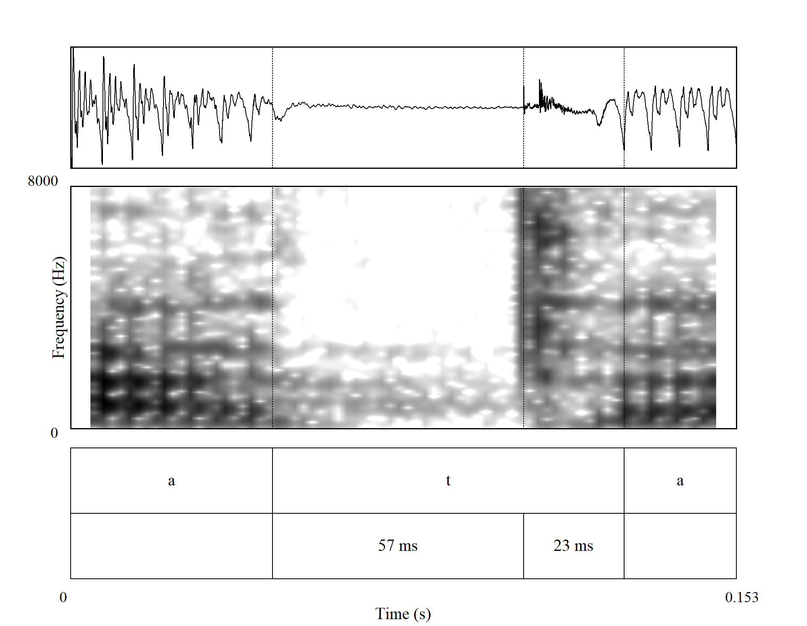
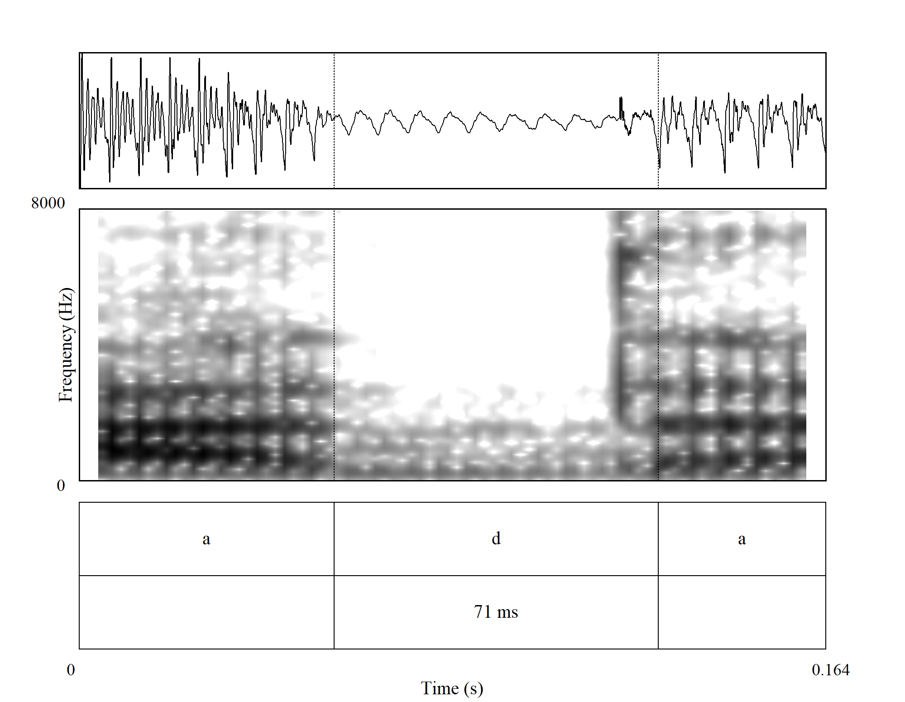
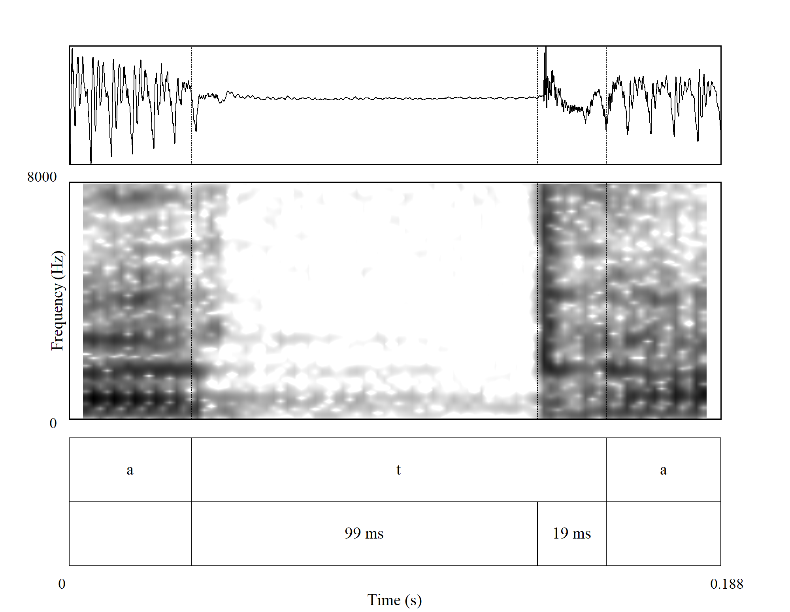
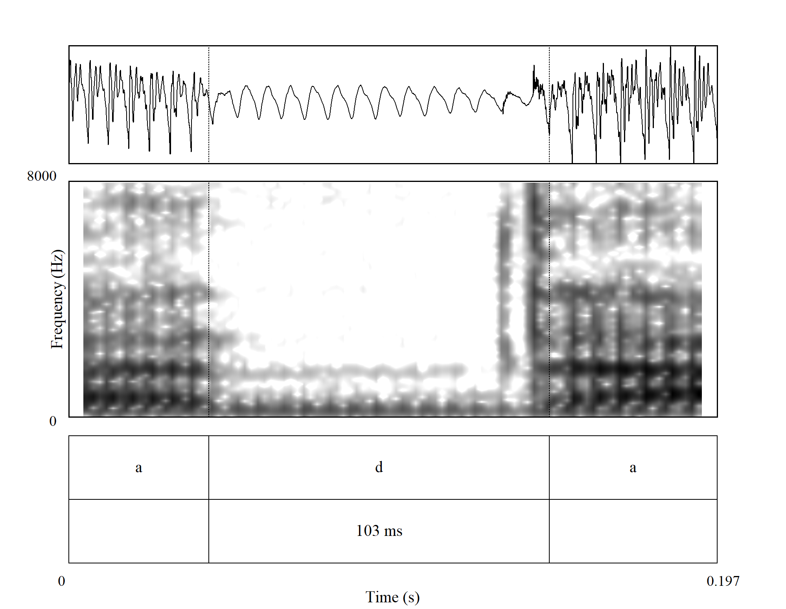
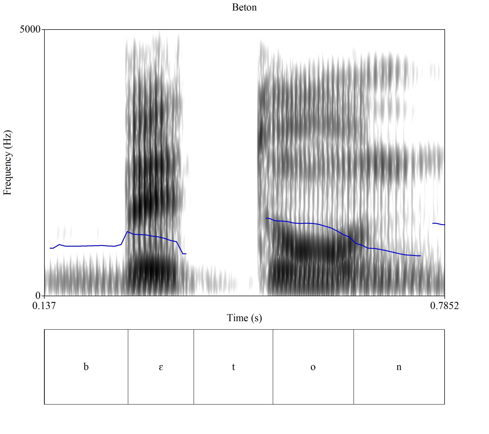

# Soglasniki

## O soglasnikih

**Soglasnike** fonetično ločimo glede na tri glavne kriterije: **zvenečnost**, **mesto artikulacije** in **način artikulacije**. Ogledali si bomo predvsem različne načine artikulacije oz. tvorbe 	soglasnikov (poglavje povzeto po @hall_phonologie_2000 [str. 5--22]). 

**Mest artikulacije** (oz. **tvorbe**) ločimo enajst (gl. tudi tabelo -@tbl-artikulacijska-mesta):

- Glasovi, ki se tvorijo skozi ožino med zgornjo in spodnjo ustnico, so **ustnični** oz. **dvoustnični** (**bilabiali**). Spodnja čeljust se pri tem ne premika, zato je spodnja ustnica artikulator, zgornja pa mesto artikulacije. V slovenščini so dvoustničniki naslednji glasovi: [p], [b] in [m].
- Pri **zobnoustničnih** (**labiodentalnih**) glasovih se spodnja ustnica dotakne zgornjih sekalcev. V slovenščini so zobnoustnični naslednji glasovi: [ɱ], [f], [ʋ].
- Glasovi, pri katerih se konica jezik dotakne/približa zgornjim sekalcem so **zobni** (**dentalni**) glasovi. V standardni slovenski izreki teh glasov praviloma ni (lahko sta pri posameznem govorcu dlesnična [d] in [t] izgovorjena bolj spredaj pri zobeh, tj. [t̪] in [d̪]).[^1so] Dva dentala sta nam znana iz angleščine, zveneči [ð] in nezveneči [θ].
- Glasovi, pri katerih se konica jezik dotakne/približa zgornji dlesni so **dlesničniki** (**alveolari**). V slovenščini so dlesničniki naslednji glasovi: [t], [d], [n], [ɾ], [s], [z], [ʦ], [ʣ] in [l].
- Glasovi, pri katerih se jezični hrbet približa mestu, neposredno za dlesnijo, se imenujejo **zadlesničniki** oz. **postalveolari**. Ti glasovi so vedno laminalni. Hrbet (dorsum) jezika je vzdignjeno. V slovenščini so zadlesnični: [ʃ], [ʒ], [ʧ] in [ʤ].
- Glasovi, pri katerih se konica jezika dotika mesta, neposredno za dlesnijo, se imenujejo **retrofleksi**. Retrofleksi so vsi apikalni. V standardni slovenščini teh glasov ni, najdemo jih v drugih jezikih, simboli zanje so: [ʈ], [ɖ], [ɳ], [ɽ], [ʂ], [ʐ], [ɻ] in [ɭ].
- Glasovi, pri katerih se sprednji del jezičnega hrbta približa trdemu nebu, so **trdonebniki** (**palatali**). V slovenščini je to [j].
- Glasovi, pri katerih se zadnji del jezičnega hrbta približa mehkemu nebu, so **mehkonebniki** (**velari**). V slovenščini so to [k], [ɡ], [x], [ŋ­] in [ɣ].
- Glasovi, pri katerih se jezični hrbet približa uvuli (jezičku), se imenujejo **uvulari**. V standardni slovenski izreki uvularov nimamo, najdemo jih v drugih jezikih, simboli zanje so: [q], [ɢ], [ɴ], [ʀ], [χ] in [ʁ].
- Glasovi, pri katerih se koren jezika približa žrelu (farinksu), so **faringealni** glasovi. V standardni slovenščini jih ne poznamo, poznani so npr. v arabščini. Simbola za faringealna glasova sta [ħ] in [ʕ].
- Glasovi, pri katerih se glasilki približata druga drugi (drugih artikulacijskih gibov pa 	ni), so **grleni** (**glotalni**) glasovi. Med fonemi slovenskega standardnega jezika jih ne 	najdemo. Njihovi simboli so: [ʔ], [h] in [ɦ].

[^1so]: @toporisic_slovenska_2000 [str. 79, 82] sicer uvršča fonema /t/ in /d/ med zobne/dentalne glasove, a @bezlaj_oris_1939 [str. 15], ki je edini do zdaj izvedel artikulacijske raziskave izgovora posameznih fonemov, za /t/, /d/ in /n/ piše, da "se tvorijo s popolno zaporo na alveolah in stranskem robu trdega in mehkega neba. Dotik na nebu sega na zobe samo na spodnjem delu, na prehodu med dlesni in zobmi. Artikulacija je pretežno alveolarna, kot po večini v slovanskih jezikih, razen v srbščini, za katero ima Miletić večino primerov z izrazito dentalno 		zaporo."

| Slovenski izraz | Mednarodni izraz | Artikulator | Mesto artikulacije | Primeri |
|-----------------|------------------|-------------|--------------------|----------|
| ustničen/dvoustničen | bilabialen | spodnja ustnica | zgornja ustnica | p b m |
| zobnoustničen | labiodentalen | spodnja ustnica | zgornji sekalci | ɱ f ʋ |
| zoben | dentalen | sprednji del hrbta jezika | zgornji sekalci | (t̪ d̪) |
| dlesničen | alveolaren | konica jezika | trdo nebo | t d n ɾ s z ʦ ʣ l |
| zadlesničen | postalveolaren | sprednji del hrbta jezika | trdo nebo | ʃ ʒ ʧ ʤ |
| retrofleksen |  | konica jezika | trdo nebo | (ʈ ɖ ɳ ɽ ʂ ʐ ɻ ɭ) |
| trdoneben | palatalen | hrbet jezika | trdo nebo | j |
| mehkoneben | velaren | hrbet jezika | mehko nebo | k ɡ x ŋ ɣ |
| jezićkov | uvularen | hrbet jezika | uvula/jeziček | (q ɢ ɴ ʀ χ ʁ) |
| žrelen | faringealen | koren jezika | žrelo | (ħ ʕ) |
| grlen | laringealen | glasilki | glasilki | (ʔ h ɦ) |

: Artikulatorji in mesta artikulacije {#tbl-artikulacijska-mesta}

*Opomba.* Povzeto in prirejeno po @hall_phonologie_2000 [str. 8]. V oklepajih so zapisani glasovi, ki jih standardna slovenščina nima.

## Zaporniki

Za tvorbo zapornikov je značilna popolna zapora govorne cevi, ki se sunkoma sprosti in nastane značilen pok (eksplozija). Mehko nebo je privzdignjeno, zato zračni tok teče le skozi ustno votlino in ne skozi nosno. Za slovenščino so značilna **ustnična** (**bilabialna**) [b] in [p], **dlesnična** (**alveolarna**) [d] in [t] ter **mehkonebna** (**velarna**) [k] in [ɡ]. Pare ločimo glede na zvenečnost.

### Akustične značilnosti zapornikov

Za zapornike so značilne tri faze pri njihovi tvorbi [povzeto po @kent_acoustic_2002, str. 45-46]: 
1. Faza **zapore govorne cevi**: V času zapore govorne cevi je zračni pritisk zaprt v ustni votlini. Akustično je zapora govorne cevi tišina. Nizko vrednost energije na celotnem ali na delu zapore je moč zaznati pri zvenečih zapornikih. Ta energija je zgoščena v 	območju nizkih harmoničnih frekvenc, še posebej v območju osnovne frekvence (F~0~).	Teoretično je vrednost F~0~ v času eksplozije blizu 0 Hz.
2. Faza **eksplozije**: Ko se zapora sprosti, se sunkovito sprosti tudi pritisk, ujet v ustni votlini. Sprostitev pritiska je akustično vidna kot eksplozija ali prehod. Eksplozija je podobna zelo kratkemu šumu pripornika. Npr. eksplozija pri dlesničnem [t] je podobna kratkemu šumu dlesničnega pripornika [s]. Spektrum eksplozije odraža mesto artikulacije. Če zaporniku sledi samoglasniški segment, potem za eksplozijo sledi še prehod (tranzient). 
3. Faza **prehoda**: V času prehoda se artikulator premakne v položaj za izgovor naslednjega segmenta, to ne traja več kot 50 ms. Če je zapornik zveneč, se prehod odraža v spremembi formantnega vzorca.

Zaporniki so arhetipski predstavniki soglasnikov, saj so največje nasprotje samoglasnikov. Pri zapornikih je govorna cev popolnoma zaprta, pri samoglasnikih pa povsem odprta [@kent_acoustic_2002, str. 140].

Edina značilnost, skupna vsem zapornikom, je popolna zapora govorne cevi. Druge značilnosti so odvisne od položaja zapornika v zlogu, tj. ali je zapornik na začetku zloga (tip CV), ali na koncu (tip VC). Zaporniki na začetku zloga, četudi jim sledi nek drug soglasnik, imajo podobne  akustične lastnosti kot zaporniki neposredno pred samoglasnikom, zato jim bomo rekli kar predsamoglasniški zaporniki. Akustično jih sestavlja (artikulacijska) zapora, ki načeloma traja med 50 in 100 ms. Ta se sprosti s hipno eksplozijo. Zaporo akustčno razumemo kot čas, ko je oddane nič oz. zelo malo energije. Eksplozija nastane, ker iz ustne votline uide ujeti zračni pritisk. Eksplozijo nekateri enačijo kar s prehodom (tranzientom), saj gre za izjemno kratek akustičen pojav. Eksplozija traja med 5 in 40 ms, gre enega najkrajših akustičnih pojavov, ki jih fonetiki opazujemo. Eksplozija je lahko dveh vrst, lahko vsebuje pridih (aspirirana) ali pa je brez njega  (neaspirirana). Pridih (ali aspiracija) je brezzvočen oz. zamolkel šum, ki nastane, ko zrak potuje skozi delno zaprti glasilki v žrelo (farinks). Fonetično je enak grlenemu priporniku [h]. Običajno aspiracijo zapisujemo s [^h^], npr. [t^h^]. Aspiracijo ločimo od eksplozije s pomočjo šuma na spektrumu. Aspiracija se pojavi v kratkem intervalu med eksplozijo in zvenečnostjo naslednjega samoglasnika. Čas med zaporo in zvenečnostjo naslednjega samoglasnika je **čas do začetka zvenečnosti** (**VOT**). Včasih eksplozije in aspiracije ne gre zlahka ločiti. Za nezveneče zapornike pred samoglasnikom je značilno, da je VOT zakasnjen glede na eksplozijo. Zakasnitev traja med 25 in 100
ms. Zveneči zaporniki so redkeje aspirirani, saj se takoj po eksploziji začnejo tresti glasilke.

![Delitev zapornikov, prirejena po @kent_acoustic_2002 [str. 140]](../slike/diagram-zaporniki.png){#fig-diagram width=70% }

### Čas do začetka zvenečnosti

**Čas do začetka zvenečnosti** (angl. voice onset time, VOT) je čas od konca zapore (prehoda) in do začetka zvenečnosti naslednjega samoglasnika. Zvenečnost je na spektrogramu vidna kot počrnitev spodnjega dela frekvenčnega območja. Lahko ločimo tri različne vrste VOT [@kent_acoustic_2002, @harrington_acoustic_2013, str. 111]: 
1. predzvenečnost (angl. prevoicing) = zvenečnost se začne pred koncem zapore oz. pred eksplozijo;
2. simultana zvenečnost (angl. simultaneous voicing) = zvenečnost se začne takoj po koncu zapore;
3. kratek zamik zvenečnosti (angl. short lag) = zvenečnost se začne kmalu po eksploziji; 
4. dolg zamik zvenečnosti (angl. long lag) = zvenečnost se začne po eksploziji z zamikom. 

Shematičen prikaz časa do začetka zvenečnosti je prikazan na sliki -@fig-zapora.

V nekaterih jezikih (npr. angleščini) je VOT glaven kriterij za razlikovanje vzglasnih zvenečih od nezvenečih zapornikov. VOT je lahko tudi dober indikator mesta izgovora, saj imajo mehkonebni zaporniki praviloma daljši čas do začetka zvenečnosti od dlesničnih zapornikov, VOT dlesničnih zapornikov pa daljši od ustničnih zapornikov [@harrington_acoustic_2013, str. 110].

Oglejmo prikaz časa do začetka zvenečnosti za /t/ in /d/ v okolju \#TV in VTV.[^2so] Posneli smo štiri povedi,  pri čemer sta besedi *ada* in *dabla* uporabljeni zato, da zagotovimo minimalni par (med besedama *ata* in *ada* ter *tabla* in *dabla* je fonološko razlika le v zvenečnosti (gl.sliki -@fig-ata  in -@fig-tabla)). Če primerjamo oba prikaza za /t/ in oba za /d/, je vidna razlika v nizkofrekven£nem območju, kjer pri /t/ manjka počrnjen pas, ki predstavlja osnovni ton (F~0~), pri /d/ pa je osnovni ton prisoten. Gre za pomembno razlikovalno lastnost, za zvenečnost. V okviru akustične fonetike najlažje razlikujemo med zaporniki glede na zvenečnost.

[^2so]: \# -- pavza, premor, T -- zapornik, V -- samoglasnik.

::: {#fig-ata layout-ncol=2}

{width=50%}

{width=50%}

Prikaz oscilograma in spektrograma zapornikov /t/ in /d/ v položaju med dvema samoglasnikoma sredi besede; besedi *ata* in *ada* v povedih *Moj ata Smrk.* oz. *Moj ada Smrk.*

:::

::: {#fig-tabla layout-ncol=2}

{width=100%}

{width=100%}

Prikaz oscilograma in spektrograma zapornikov /t/ in /d/ v položaju na začetku besede; besedi *tabla* in *dabla* v povedih *Lepa tabla je.* oz. *Lepa dabla je.*

:::

{#fig-zapora width=90%}

::: {#fig-panda layout-ncol=2}

    

Prikaz sonagrama in intonacije (F~0~) pri besedah *panda* in *beton*.

:::

