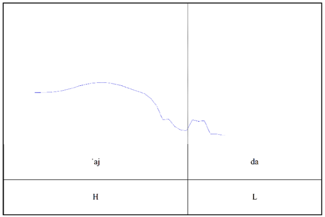
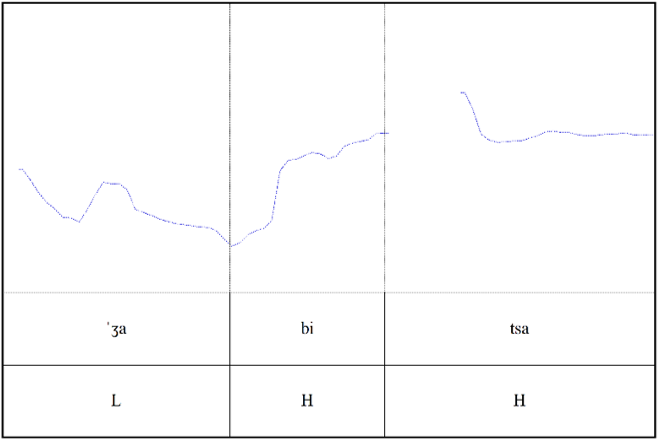

# Tonemski naglas

Ocenjeno je, da ima 70 % jezikov sveta tonemski naglas. Jezik ima tonemski naglas, če osnovni ton razlikuje pomen besed, npr. v kantonščini (narečje kitajščine) ima zlog [jau] lahko šest različnih pomenov, odvisno od tona [povzeto po @yip_tone_2011, str. 229]:

|   Ton      |    Oznaka      | Pomen         |
|---------|----------|---------|
| visoki      | V́ oz. ˦  | 'skrb'  |
| visok rastoč | V᷄ oz. ˦˥ | 'barva' |
| srednji     | V̄ oz. ˧  | 'tanek' | 
| nizek        | V̀ oz. ˨  | 'spet'  |
| zelo nizek  | V̏ oz. ˩  | 'olje'  |
| nizek rastoč | V᷅ oz. ˩˨ | 'imeti' |

*Opomba.* Oznake V́, V̄, V̏, V᷄, V̀ in V᷅ predstavljajo tonske naglase, simboli ˦, ˧, ˩, ˦˥ in ˩˨ označujejo relativno višino oziroma potek osnovne frekvence, simboli so v skladu z mednarodno fonetično abecedo IPA.

Pri tonemskem/tonskem/intonacijskem naglaševanju ločimo različne tonske poteke. Za slovenščino sta značilna dva poteka: **rastoči** ali **akut** ter **padajoči** ali **cirkumfleks**. 

V Praatu tonem določimo s pomočjo poteka osnovnega tona (F~0~).[^1t]  Besedo razdelimo na zloge ter določimo naglašeni samoglasnik. Akustično ima naglašeni samoglasnik v primerjavi z drugimi v besedi najvišjo intenziteto (glasnost v dB) ter je običajno najdaljši. Da določimo višino tona naglašenega samoglasnika, moramo primerjati njegovo vrednost F~0~ z vrednostjo F~0~ naslednjega samoglasnika. Tisti zlog, ki ima višji F~0~ označimo z H (high, visok ton), drugega pa z L (low, nizek ton). Pred H ali L pri naglašenem samoglasniku zapišemo še *, tako označimo, da je tisti segment naglašen/intenzivnejši. Tako dobimo kombinacijo *H + L (padajoč ton, gl. sliko -@fig-ajda) ali *L + H (rastoč ton, gl. sliko -@fig-zabica).

[^1t]: Osnovi ton (F~0~) je prikazan samo pri segmentih, kjer je zaznati periodično nihanje glasilk, tj. je segment zveneč. @jurgec_acoustic_2007 [str. 1089] poroča, da intenziteta na dolžina samoglasnika statistično ne vplivata na ton, bistvena je osnovna frekvenca.

{#fig-ajda width=50% }

{#fig-zabica width=50% }

Pri besedi *žabica* med zlogoma [bi] in [ʦa] vidimo t. i. skok. Ta je posledica nezvenečih soglasnikov med zvenečim segmenti. Pri primerih *ajda* in *žabica* gre za večzložnice, pri katerih je naglašen nezadnji zlog, zato lahko višino F~0~ primerjamo z naslednjim zlogom. Pri besedah, ki so naglašene na zadnjem ali edinem zlogu, pa tega ne moremo, saj se mora vse zgoditi na enem zlogu, ni skoka. Pomagamo si lahko s stiliziranimi prikazi (gl. sliki -@fig-bariton in -@fig-oksiton). @srebot-rejec_o_2000 [str. 130] zagotavlja, da besedni naglas na kratkih oksitonih[^2t]  ni razločevalen, obstaja samo t. i. kratki cirkumfleks, na dolgih oksitonih pa lahko najdemo oba naglasa (glede na SSKJ je akut na dolgih oksitonih redek).

[^2t]: Oksiton je beseda z naglasom na zadnjem ali edinem zlogu, bariton = beseda z naglasom na nezadnjem zlogu.

![Stiliziran prikaz obeh tonemov na baritonu [@srebot-rejec_ali_2000, str. 53–55]](../slike/Slika-bariton.jpg){#fig-bariton width=50% }

*Opomba.* a = 1. varianta cirkumfleksa; b = 2. varianta cirkumfleksa; c = akut.

![Stiliziran prikaz obeh tonemov na oksitonu [@srebot-rejec_ali_2000, str. 53–55]](../slike/Slika-oksiton.jpg){#fig-oksiton width=50% }

*Opomba.* a = rastoči cirkumfleks; b = rastoči-padajoči cirkumfleks; c = rastoči akut.

V mednarodni fonetični abecedi IPA označimo visok ton z [´],  nizkega pa z [`], npr. [ˈʒàbítsa]. 